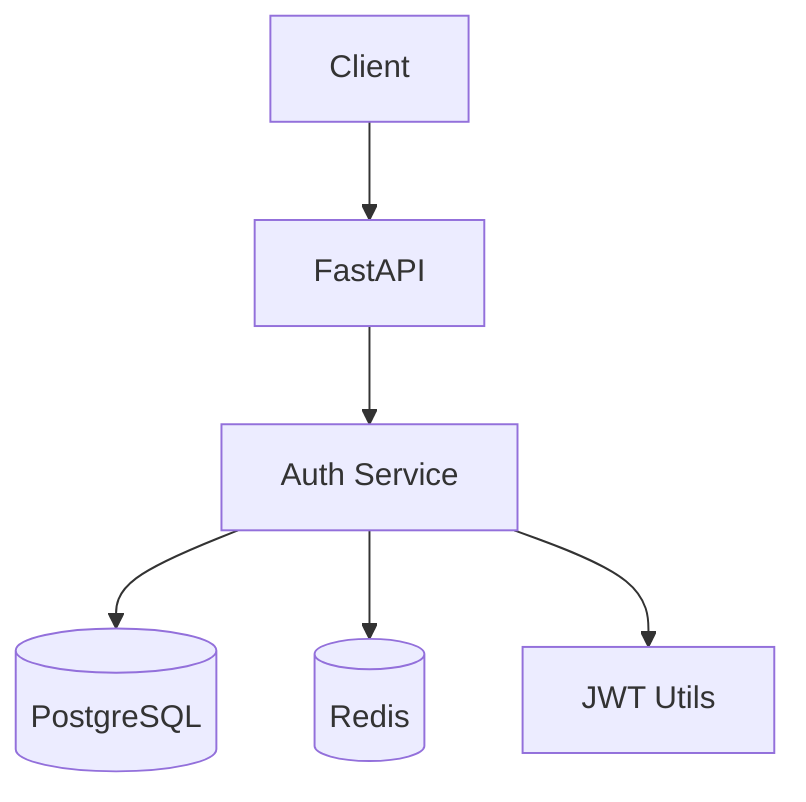

# Guia dos Agentes SDD

## Agente 1: Orchestrator

**Função**: Ponto central de entrada. Classifica intenção e roteia para agentes especializados.

**System Prompt (resumo)**:
```
Você é o coordenador de um time de agentes de desenvolvimento de software.
Analise a mensagem do usuário e determine:
1. Qual agente (ou sequência) deve tratar a requisição
2. Que contexto do projeto é relevante
3. Se múltiplos agentes devem colaborar

Agentes disponíveis: requirements, architecture, code_generator, test, reviewer, debug
```

**Lógica de roteamento**:
```python
INTENT_MAP = {
    "feature_request":    ["requirements", "architecture", "code_generator"],
    "code_generation":    ["code_generator", "reviewer"],
    "bug_report":         ["debug"],
    "architecture_query": ["architecture"],
    "test_request":       ["test"],
    "code_review":        ["reviewer"],
    "explain_code":       ["reviewer"],  # reviewer também explica
}
```

---

## Agente 2: Requirements

**Trigger**: Usuário descreve uma necessidade de negócio ou feature.

**Responsabilidades**:
- Elicitar requisitos através de perguntas
- Identificar casos de uso e edge cases
- Gerar documento de requisitos estruturado
- Validar critérios de aceite

**Ferramentas**:
- `read_file`: lê documentação existente do projeto
- `write_file`: salva documento de requisitos gerado
- `search_codebase`: verifica se feature similar já existe

**Output típico**:
```markdown
## Requisito: Autenticação de Usuário

**User Story**: Como usuário, quero fazer login com email/senha para acessar o sistema.

**Critérios de Aceite**:
- [ ] Login com email e senha válidos retorna JWT token
- [ ] Senha incorreta retorna erro 401
- [ ] Token expira em 24 horas
- [ ] Refresh token válido por 7 dias

**Edge Cases**:
- Múltiplas tentativas falhas → bloqueio temporário
- Token expirado durante sessão → refresh automático
```

---

## Agente 3: Architecture

**Trigger**: Perguntas sobre design, "como estruturar", "qual a melhor abordagem".

**Responsabilidades**:
- Propor design de sistema
- Gerar diagramas (Mermaid/PlantUML)
- Documentar decisões arquiteturais (ADRs)
- Recomendar padrões e tecnologias

**Ferramentas**:
- `read_file`: entende arquitetura existente
- `search_codebase`: analisa padrões usados
- `web_search`: pesquisa boas práticas atuais

**Output típico**:


---

## Agente 4: Code Generator

**Trigger**: "Implemente", "crie", "escreva código para".

**Responsabilidades**:
- Gerar código consistente com o estilo do projeto
- Seguir padrões detectados no codebase
- Incluir docstrings e comentários relevantes
- Considerar imports e dependências existentes

**Ferramentas**:
- `read_file`: lê arquivos relacionados para manter consistência
- `search_codebase`: encontra padrões e utilitários existentes
- `write_file`: salva código gerado (com confirmação do usuário)
- `run_linter`: valida código antes de entregar

**Output típico**:
```python
# src/auth/service.py
from datetime import datetime, timedelta
from jose import jwt
from .models import User
from .config import settings

def create_access_token(user: User) -> str:
    """Gera JWT token para o usuário autenticado."""
    payload = {
        "sub": str(user.id),
        "exp": datetime.utcnow() + timedelta(hours=24),
    }
    return jwt.encode(payload, settings.SECRET_KEY, algorithm="HS256")
```

---

## Agente 5: Test

**Trigger**: "Teste para", "cobertura de", "escreva testes".

**Responsabilidades**:
- Gerar testes unitários, integração e e2e
- Identificar casos de borda a testar
- Criar fixtures e mocks adequados
- Sugerir estratégia de cobertura

**Ferramentas**:
- `read_file`: lê código a ser testado
- `run_tests`: executa testes e reporta resultado
- `write_file`: salva arquivos de teste
- `search_codebase`: encontra padrões de teste existentes

**Output típico**:
```python
# tests/test_auth_service.py
import pytest
from unittest.mock import MagicMock
from src.auth.service import create_access_token

def test_create_access_token_returns_valid_jwt():
    user = MagicMock(id=1)
    token = create_access_token(user)
    assert token is not None
    assert len(token.split(".")) == 3  # JWT format

def test_create_access_token_expires_in_24h():
    user = MagicMock(id=1)
    token = create_access_token(user)
    payload = jwt.decode(token, settings.SECRET_KEY)
    exp = datetime.fromtimestamp(payload["exp"])
    assert exp > datetime.utcnow() + timedelta(hours=23)
```

---

## Agente 6: Code Reviewer

**Trigger**: "Revise", "analise", "o que você acha deste código".

**Responsabilidades**:
- Análise de qualidade e legibilidade
- Detecção de vulnerabilidades de segurança
- Verificação de boas práticas e padrões
- Sugestões de otimização de performance
- Checagem de OWASP Top 10

**Ferramentas**:
- `read_file`: lê código a ser revisado
- `run_linter`: análise estática automática
- `search_codebase`: verifica consistência com o restante do projeto

**Output típico**:
```
## Code Review - src/auth/service.py

### Problemas Críticos
- [SEGURANÇA] Senha comparada sem hash: `user.password == input_password`
  → Use: `bcrypt.verify(input_password, user.password_hash)`

### Melhorias Sugeridas
- [PERFORMANCE] Query N+1 na linha 42 ao buscar permissões
  → Adicione eager loading: `query.options(joinedload(User.roles))`

### Boas Práticas
- Considere adicionar rate limiting no endpoint de login
- Logs de tentativas de autenticação para auditoria

### Aprovado para
- Estrutura geral do código
- Tratamento de erros HTTP
- Tipagem e docstrings
```

---

## Agente 7: Debug

**Trigger**: Stack traces, "não funciona", "erro", mensagens de exception.

**Responsabilidades**:
- Analisar stack traces e mensagens de erro
- Identificar causa raiz do problema
- Propor correção com explicação
- Sugerir como evitar o problema no futuro

**Ferramentas**:
- `read_file`: lê arquivos mencionados no stack trace
- `search_codebase`: encontra onde o erro pode originar
- `run_code`: executa snippets para validar hipóteses
- `web_search`: pesquisa erros conhecidos/issues

**Output típico**:
```
## Diagnóstico: AttributeError: 'NoneType' has no attribute 'id'

**Causa Raiz**: `User.query.get(user_id)` retorna None quando o ID não existe,
mas o código assume que sempre retornará um objeto.

**Linha problemática** (src/auth/service.py:34):
```python
# Atual (quebra):
user = User.query.get(user_id)
return user.id  # AttributeError se user=None

# Corrigido:
user = User.query.get(user_id)
if user is None:
    raise UserNotFoundError(f"User {user_id} not found")
return user.id
```

**Como evitar**: Use `get_or_404()` em endpoints HTTP ou implemente um
repositório com tratamento explícito de not found.
```
